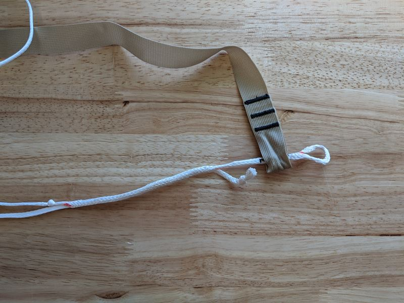
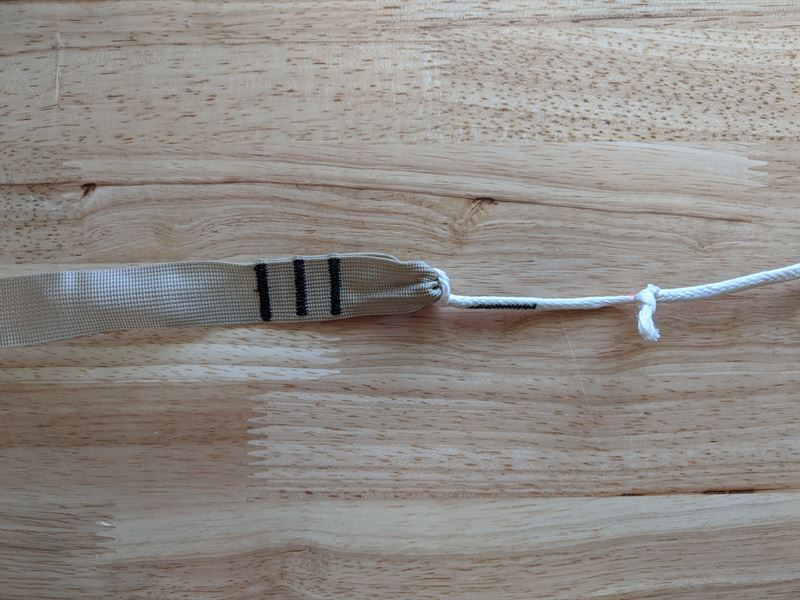

# Tree Strap Repair & Reassembly

Use this guide to replace the webbing or Whoopie Sling of your Tree Strap or Tree Strap+.

## PARTS

[Replacement Webbing](https://hummingbirdhammocks.com/products/replacement-tree-strap-webbing)
[Replacement Whoopie Sling](https://hummingbirdhammocks.com/products/replacement-whoopie-sling)

The webbing and whoopie Sling of your tree strap are attached using a simple larks head knot.

Disassemble the old parts by pulling apart the larks head knot.

Ensure your whoopie sling is extended to its fullest length. The tail of the adjustable cord should be closest to the finger trap.

Insert the small fixed loop of your whoopie sling into the smaller loop of the webbing. You will notice one of your webbing's loop ends is slightly larger - this is NOT the end to which your whoopie sling should be attached.

Feed the large adjustable loop of your whoopie sling through the small fixed loop, pulling the adjustable loop and finger trap all the way through the small loop.

You should now have a larks head knot securing the two parts together.

Pull the knot tight and you are ready to hang!
