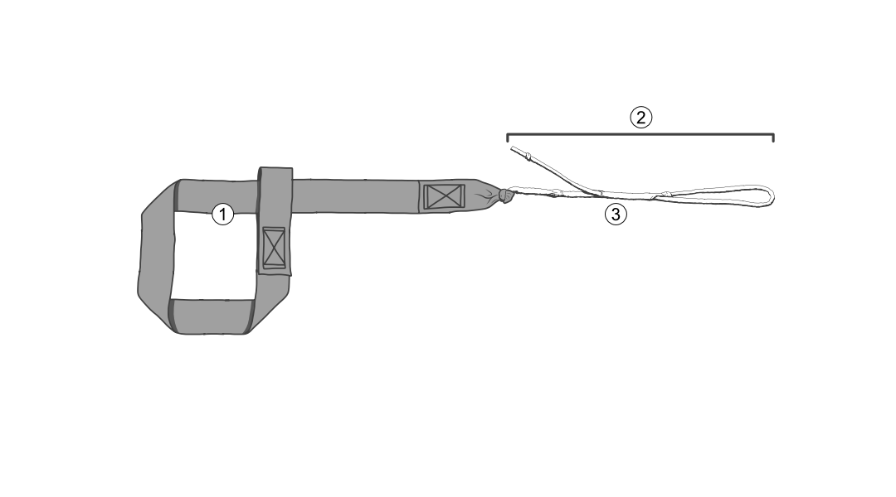
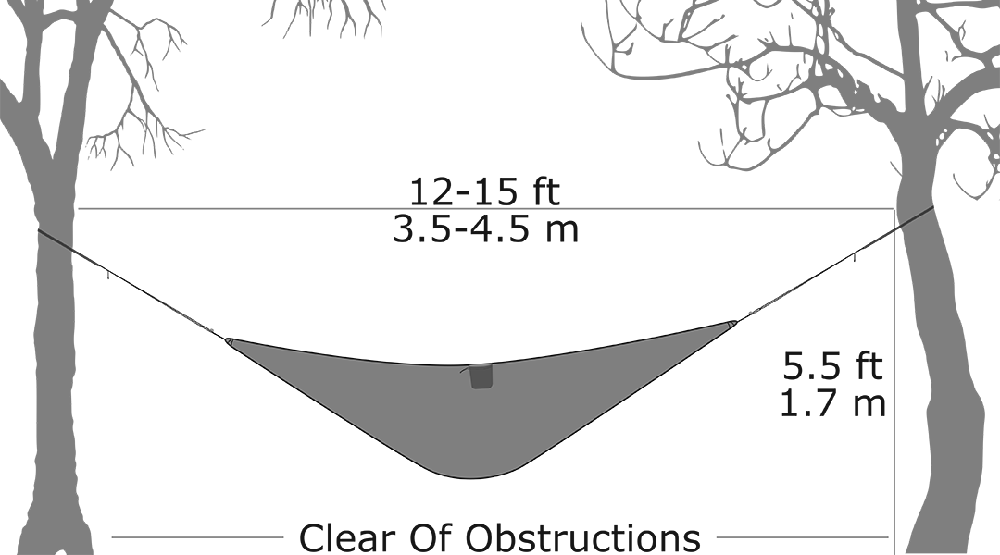
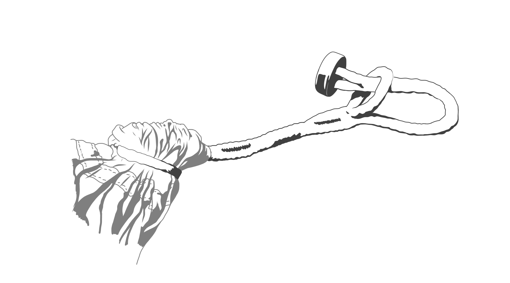
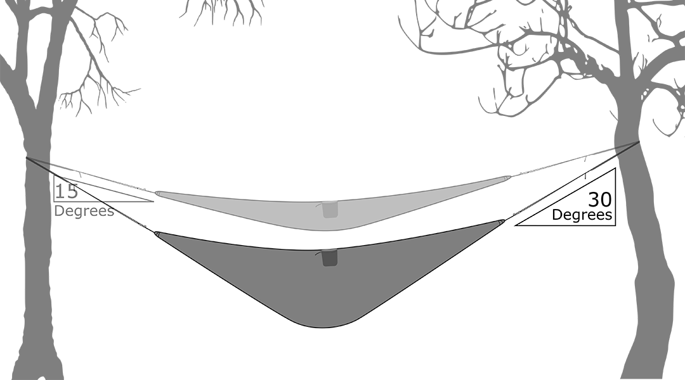

# Tree Strap Manual

## Table of Contents

- [Tree Strap Manual](#tree-strap-manual)
  - [Table of Contents](#table-of-contents)
  - [VIDEO GUIDES](#video-guides)
    - [Tree Straps](#tree-straps)
    - [Extensions](#extensions)
  - [Parts](#parts)
  - [CHECK](#check)
  - [LOCATION](#location)
  - [TREE STRAPS](#tree-straps-1)
  - [ATTACH](#attach)
  - [TENSION](#tension)
  - [TREE STRAP EXTENSIONS](#tree-strap-extensions)
  - [WARNING](#warning)
  - [THANK YOU](#thank-you)
  - [CONTACT](#contact)

## VIDEO GUIDES

### Tree Straps

https://youtu.be/CR3VP24MzYA

### Extensions

https://youtu.be/khd7KzIo8_E

## Parts

1. Webbing
2. Whoopie Sling
3. Finger Trap

## CHECK

Look for signs of wear, damage, loose stitching, or discoloration. If you find anything that would indicate a potential failure, please contact us before using the hammock and we will provide advice on how to proceed.

Never exceed the maximum rated weight for each hammock or tree straps. These weight ratings exist to protect the equipment and the user, and are the maximum safe weight the hammock will hold. The maximum weight an entire system will hold is dictated by the weakest piece of equipment, for example if the tree straps are rated to 400 lbs and the hammock is rated to 300 lbs, the weight supported by the entire system must not exceed 300 lbs.

Ensure there are no sharp objects in your back pockets or on your pants, any small rocks or other debris in the hammock that may damage it. This is the most common reason for a failure.

## LOCATION

Look for a spot with two sturdy trees (or other objects to attach to) that are about 12 to 15 feet apart. Be sure the trees are thick enough and healthy enough to hang from, we recommend at least 8 inches in diameter. One of the major advantages of hammock camping is not having to worry about finding a clear and flat spot for a tent. However we still recommend not setting up over sharp rocks or at the edge of a cliff.

## TREE STRAPS

Attach the webbing end of the tree straps to the trees by wrapping them around the trunk and passing the whoopie sling end of the strap through the small sewn webbing loop. Pull the extra slack out of the webbing loop created around the tree, and snug them up about 6 feet from the ground.

Adjustment to the whoopie sling must be done while there is no weight on the hammock or straps. To adjust the length of the whoopie slings so they are shorter, simply pull the single string extending from the finger trapped section with the single knot on the end. To extend the whoopie sling, hold onto the knot on the loop section just before the fingertrap section and then extend the loop by pulling gently on the opposing side of the loop. Holding the knot during this process relives strain on the fingertrap to allow movement and lengthening of the whoopie sling.

Adjust the whoopie slings out to allow enough length to attach the hammock, leave some extra slack at this point to make it easier to assemble.

## ATTACH

Remove hammock from stuff sack, drape it over your shoulder or around your neck to keep it off the ground. Using the attachment system included with your hammock, attach the hammock to the tree straps one end at a time. Connect your carabiner or button link through the large loop end of the whoopie sling on the tree strap. If your hammock does not include an attachment system from the manufacturer, you will need a carabiner or other appropriate load-bearing connection.

## TENSION

Adjust the whoopie slings, there will be some stretch when the hammock gets loaded with weight so make it a little tighter than the final intended hang angle. 30 degrees is typically considered an ideal hang angle, to achieve that angle we have found pulling the hammock so it hangs to an angle of 15 degrees before weight is added will ultimately be about right. Getting the right hang angle is trial and error and personal preference, have fun with it and see what works best for you!

## TREE STRAP EXTENSIONS

To add Tree Strap Extensions to your setup, detach the Button Link at one end of your hammock from the loop of the Tree Strap. Attach the same Button Link to the loop end of your Extension (the end without a button). Holding the hammock off the ground, attach the other end of the Extension (the end with the button) to the loop of the Tree Strap the same way you would attach your hammock's Button Link. Repeat these steps on the other end of your hammock with the other Extension. Adjust whoopie slings as necessary.

## WARNING

Do not leave the hammock or tree straps in direct sunlight. The UV light will degrade and weaken the nylon material over time.
Avoid stepping on the straps or whoopie sling, letting it drag on the ground or abrading it in any other way. This will weaken and damage the straps.
Do not use solvents or soaps to clean the straps or whoopie sling, warm or room temperature water will remove most dirt and stains. If soap is needed, only use a very small amount of a very gentle cleaner like Woolite or Revivex Pro Cleaner. Do not wash in a washing machine, gentle hand-wash only.
Dry your tree straps in the shade, out of direct sunlight.
Do not pack your tree straps up wet, this may result in mildew forming on the webbing or Spectra cord.
Be responsible when selecting trees to hang from, they should be at least 8 inches in diameter and healthy enough to support the weight.
Don’t pull the hammock too tight when adjusting your tree straps, not only will this reduce the comfort of the hammock, but will also put undue stress on the tree straps and hammock and may result in hammock failure.
Do not bounce in the hammock, bouncing puts unnecessary stress on the hammock and tree straps.
Never exceed the maximum weight rating of any piece of your gear.
Ensure there are no sharp objects that will come in contact with the hammock or tree straps, this includes sticks, knives, sharp buttons on your pants, sharp rocks, or excessive dirt in the hammock.

HAPPY HANGING!

## THANK YOU

Thank you for choosing Hummingbird Hammocks to be your adventure companion! We are honored to be a part of your kit, and appreciate how valuable your pack weight and volume is. We promise to take up as little space and weight as possible!

## CONTACT

If you have any questions, issues or want to provide us with some feedback, please contact us using one of the methods below:

https://help.hummingbirdhammocks.com/
help@hummingbirdhammocks.com
