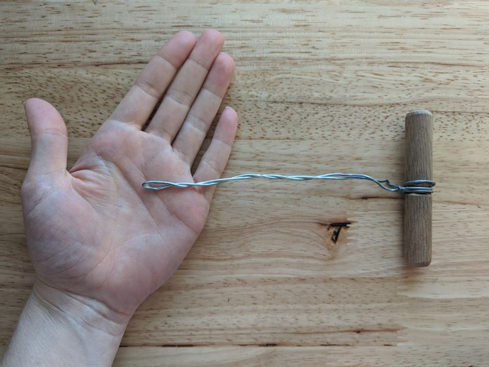
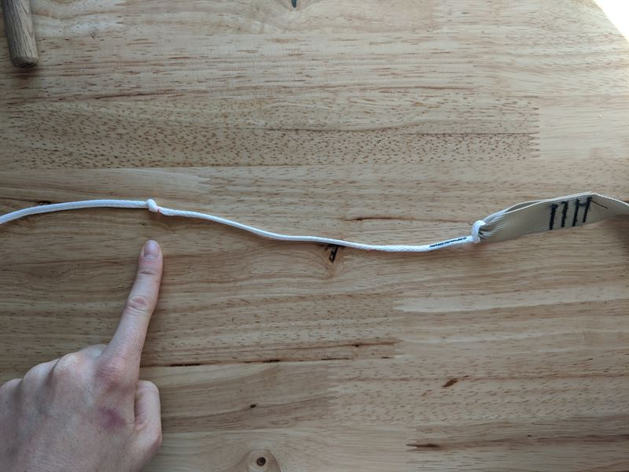
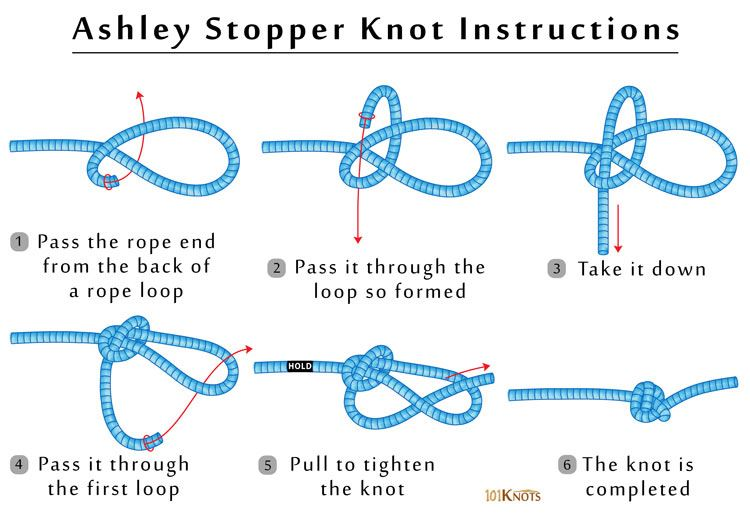
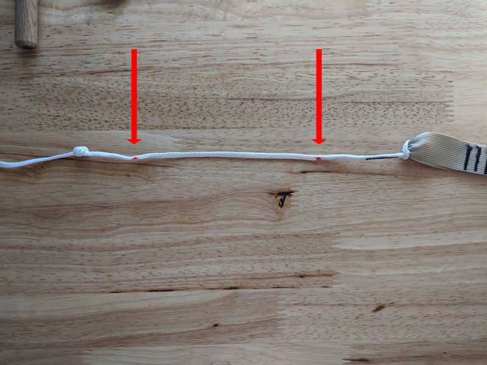
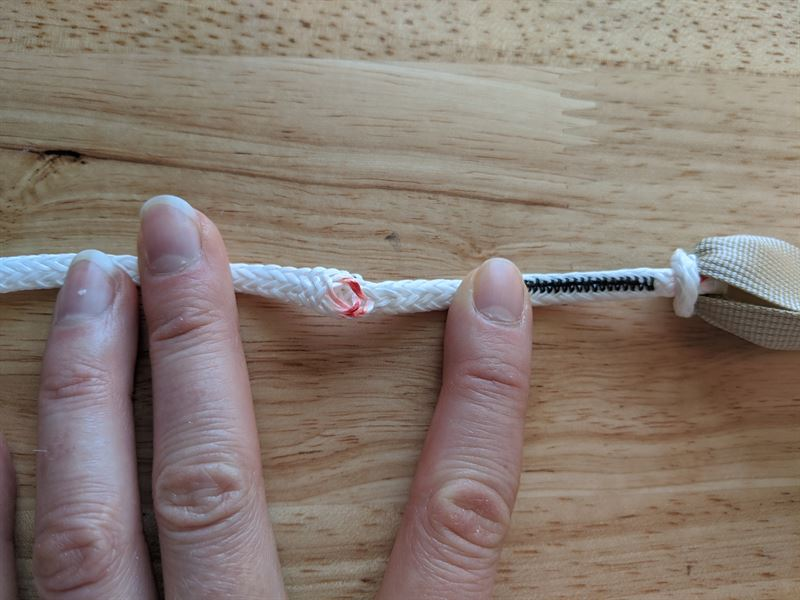
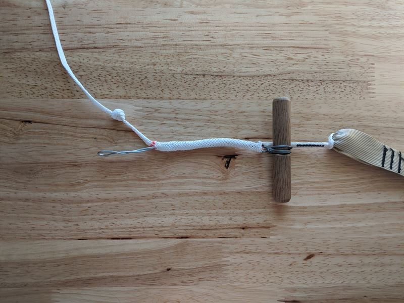
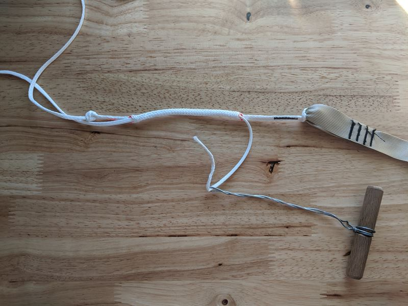
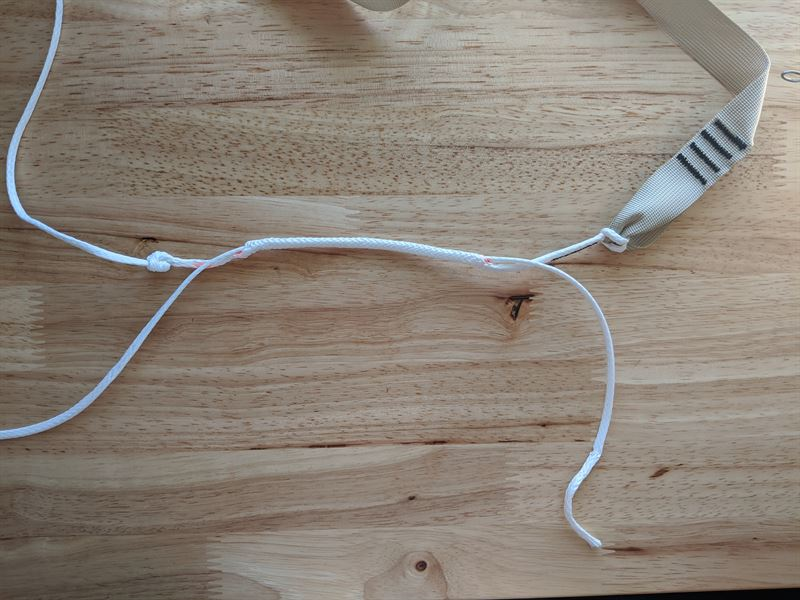
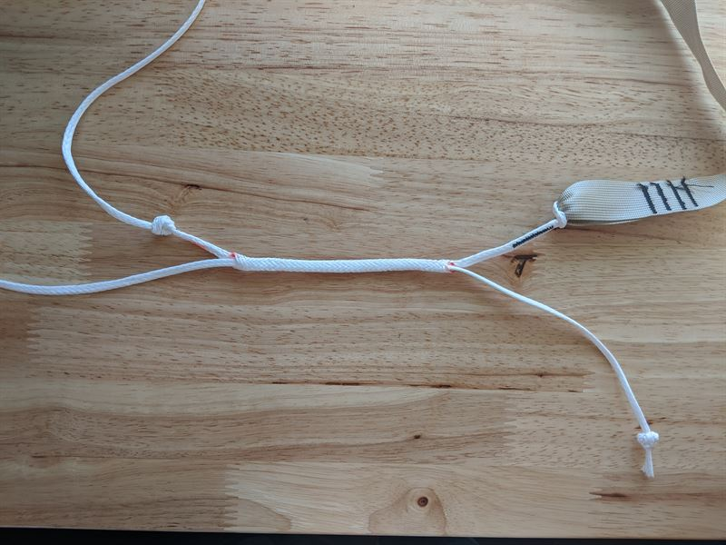

# Whoopie Sling Repair

Please follow this guide if either of the knots in your Tree Strap's white spectra cord has been pulled through the whoopie sling.

Here’s the tool we use to assemble our whoopie slings. Try to find wire of comparable thickness, like a wire coat hanger.

Start by tying a new stopper knot where the old one failed. You can keep the old one tied or untie it if you can. The following image does a great job of describing how to tie the “Ashley Stopper Knot,” which is what we’ll be using.

It’s difficult to get the new stopper knot in the same position as the old. The only thing you’re changing is the range of your adjustment, so no big deal there. Just make sure you tie your knot outside the finger trap (the space between the two red dots - or arrows in this image).

Contracting the spectra will open the weave of the cord. You will be inserting the wire through the red dot closest to the end of the Whoopie Sling (the end that's attached to the webbing of your Tree Strap.

Feed the wire through the inner channel of the spectra where the finger trap will form. 

When the wire is fully through the finger trap, thread the cord through the wire and then pull the cord back through the finger trap.

Tie one more stopper knot at the end of the spectra you just fed through the finger trap so it doesn’t pull through the other direction.

You now have a functioning Whoopie Sling! You can adjust it to its shortest length and the stopper knot will prevent it from pulling through.

That’s It!
